# Security-Constrained Agent Runtime: Full Implementation Plan

This plan is derived from [docs/DESIGN.md](DESIGN.md) and the current repo state. **Current state**: All modules under `src/` are stubs (TODO-only); no tests beyond empty `__init__.py`; dependencies are minimal (pyyaml, jsonschema, pathspec). Implementation follows the design's development phases and component specs.

---

## Current vs. Target State

| Area | Current | Target (per DESIGN.md) |
|------|---------|------------------------|
| Policy | Parser, validator, defaults stubbed | YAML/JSON load, validate schema, evaluate capability + constraints |
| Runtime | agent_runtime, policy_engine, capability stubbed | Intercept tool calls, evaluate policy, run pre/post validation, optional sandbox/approval |
| Tools | filesystem, git_ops, http_fetch, package_manager stubbed | Concrete tools with path/endpoint/param constraints |
| Security | injection_detector, parameter_validator, taint_tracking stubbed | Injection patterns, param/path/flag validation; taint as stretch |
| Utils | explainer, redaction stubbed | Human-readable denials + sensitive-data redaction |
| Audit | audit_logger stubbed | Structured JSON log of all decisions and executions |
| Tests | Only package __init__ files | Unit, integration, security (adversarial), property-based, performance |

---

## Phase 1: Core Runtime, Policy Engine, and Basic Tools

### 1.1 Policy layer

- **[src/policies/parser.py](src/policies/parser.py)**  
  - Load policy from file path (YAML or JSON).  
  - Parse into an internal structure matching design §3.1: `version`, `default_policy` (`deny`/`allow`), `capabilities` list.  
  - Each capability: `name` (e.g. `filesystem.read`), `allowed` (bool), `constraints` (paths, endpoints, resource limits, `require_approval`, etc.).  
  - Support globs for `paths.allow`/`paths.deny` and `endpoints.allow`/`endpoints.deny` (e.g. via `pathspec`).

- **[src/policies/validator.py](src/policies/validator.py)**  
  - Validate parsed policy against schema: required fields, valid capability names, constraint shapes (path lists, endpoint lists, numeric limits, booleans).  
  - Reject invalid policies with clear errors.

- **[src/policies/defaults.py](src/policies/defaults.py)**  
  - Provide a default policy (default deny) and optionally a "development" default that allows a minimal set of capabilities for local use, aligned with design §3.1 examples.

### 1.2 Capability and policy engine

- **[src/runtime/capability.py](src/runtime/capability.py)**  
  - Define capability names as constants or enums (`filesystem.read`, `filesystem.write`, `git.commit`, `git.push`, `shell.execute`, `http.fetch`, `package_manager.query`).  
  - Optional: small helpers to map "tool name" to capability and to check if a capability is "high risk" (for approval/sandbox).

- **[src/runtime/policy_engine.py](src/runtime/policy_engine.py)**  
  - `load_policy(path)` → load via parser, validate, store.  
  - `evaluate(capability, parameters)` → (1) apply default if capability missing, (2) if allowed, evaluate constraints (paths, endpoints, resource limits, `require_approval`), (3) return a decision object: allow/deny, reason, and optional "needs_approval" flag.  
  - Path/endpoint checks: normalize paths, resolve against allow/deny globs; deny takes precedence.  
  - `get_explanation(decision)` → human-readable string (or delegate to explainer).  
  - Optional: in-memory cache keyed by (capability, relevant param hash) for performance (design §5.1).

### 1.3 Base tool interface

- **[src/tools/base.py](src/tools/base.py)**  
  - Abstract base class or protocol for tools: e.g. `name` (or capability name), `execute(params) -> result`.  
  - So runtime can register and invoke tools uniformly.

### 1.4 Agent runtime (orchestrator)

- **[src/runtime/agent_runtime.py](src/runtime/agent_runtime.py)**  
  - `execute_tool(capability, parameters)` as main entry (design §4.1, §5.2):  
    1. Call policy engine `evaluate(capability, parameters)`.  
    2. If deny → log, return denial with explanation (no tool execution).  
    3. If allow and `require_approval` → call `request_approval(capability, parameters)` (queue or sync approval); on timeout/reject → deny.  
    4. If allow (and approved if required) → run pre-call validation (parameter validator, injection detector; see Phase 2), then path/endpoint checks (using constraints from policy).  
    5. Execute tool (look up by capability, call implementation).  
    6. Post-call: sanitize/redact result, audit log, return to caller.  
  - `register_tool(name, tool_impl)` to map capability (or tool name) to implementation.  
  - `request_approval(capability, parameters)` — minimal implementation: sync (e.g. CLI prompt or callback) or queue with timeout; design §4.1, §8.3.  
  - Add a `main()` (or equivalent) if the package is to be run as a CLI; fix [setup.py](setup.py) entry point if `main` is moved or renamed.

### 1.5 Basic tools (filesystem, git)

- **[src/tools/filesystem.py](src/tools/filesystem.py)**  
  - Implement read/write per design §5.3: path normalization, traversal prevention (e.g. reject `..` outside allowed base), enforce `paths.allow`/`paths.deny` and `max_file_size` from policy (passed in or read from context).  
  - Support text and binary; return results in a consistent shape for the runtime.

- **[src/tools/git_ops.py](src/tools/git_ops.py)**  
  - Implement commit, push, pull; enforce `prevent_history_rewrite`, `prevent_force_push` (design §3.1, §5.3).  
  - Use GitPython (add to requirements) or subprocess with strict checks; block force push and history-rewriting commands.

After Phase 1, the runtime can: load policy, evaluate capabilities, enforce path/git constraints, and execute filesystem and git tools through the runtime with deny/allow and basic explanations.

---

## Phase 2: Security Components (Injection Detection, Parameter Validation)

### 2.1 Parameter validator

- **[src/security/parameter_validator.py](src/security/parameter_validator.py)**  
  - Type checking/coercion (string, number, boolean, object, array) per design §3.3.  
  - Path normalization and path-traversal checks; flag filtering for shell-related params (e.g. reject `rm -rf`, `curl | sh`-style patterns if/when shell tool is added).  
  - Range (min/max) and enum validation where constraints specify.  
  - Interface: `validate(capability, parameters, constraints) -> ValidationResult` (valid or list of errors).

### 2.2 Injection detector

- **[src/security/injection_detector.py](src/security/injection_detector.py)**  
  - Pattern-based detection for prompt/output injection (design §1.2, §6.1): e.g. "Ignore previous instructions", "Execute:", "rm -rf", embedded commands in text.  
  - Optional heuristic or context-aware rules (e.g. stricter for shell, looser for read-only).  
  - Scan string parameters (and optionally stringified outputs) and return "clean" or "injection_detected" with matched pattern/reason.  
  - Configurable sensitivity if desired.

### 2.3 Integration into runtime

- In [src/runtime/agent_runtime.py](src/runtime/agent_runtime.py), after policy allows and before execution:  
  - Call parameter validator with policy constraints; on failure → deny and log.  
  - Call injection detector on relevant parameters; on detection → deny and log.  
  - Use parameter validator's path checks in addition to policy path constraints so that path traversal and dangerous paths are blocked even if policy is misconfigured (defense in depth).

---

## Phase 3: Audit Logging and Explainable Denials

### 3.1 Audit logger

- **[src/runtime/audit_logger.py](src/runtime/audit_logger.py)**  
  - Structured JSON logs (design §4.4): timestamp, agent_id, capability, parameters (redacted if sensitive), decision (allow/deny), reason, policy_rule_id, execution result (success/failure, output redacted, timing), optional performance metrics.  
  - Write to file or stream; optional rotation.  
  - Async or fire-and-forget to minimize overhead (design §2.5).

### 3.2 Redaction

- **[src/utils/redaction.py](src/utils/redaction.py)**  
  - Detect and redact sensitive data in params and results: credentials, keys, tokens, common patterns (e.g. `.env`, `id_rsa`).  
  - Used by audit logger and post-call validation (design §4.2).

### 3.3 Explainer

- **[src/utils/explainer.py](src/utils/explainer.py)**  
  - `get_explanation(decision, capability, parameters, policy)` → human-readable message (design §5.5): why denied, which constraint failed, suggested policy snippet to allow the operation, and optionally safe alternatives.  
  - Called from policy engine or runtime when returning a denial.

### 3.4 Runtime wiring

- Every allow/deny and every execution in [src/runtime/agent_runtime.py](src/runtime/agent_runtime.py) goes through the audit logger.  
- Post-call: run redaction on result before returning and before logging.  
- Denials always include explainer output.

---

## Phase 4: Security Test Suite

### 4.1 Test layout and harness

- Add unit tests under `tests/unit/` for: parser, validator, policy_engine, parameter_validator, injection_detector, explainer, redaction, each tool.  
- Add integration tests under `tests/integration/` for: full `execute_tool` flow with real policy file, filesystem and git tools, deny/allow and explanation.  
- Add security tests under `tests/security/` for adversarial scenarios (design §6.1):  
  1. Prompt injection (malicious prompts, commands in tool output).  
  2. Output injection (executable commands, JSON/XML injection).  
  3. Path traversal (`../../etc/passwd`, absolute paths, symlinks).  
  4. Flag abuse (dangerous shell flags, parameter pollution).  
  5. Credential leakage (read `.env`, `.ssh`, key files).  
  6. Git tampering (force push, history rewrite, `.git` modification).  
  7. Network exfiltration (unauthorized HTTP, non-HTTPS, large responses).  
  8. Parameter pollution (nested objects, array injection, type confusion).  
- Use pytest; optionally property-based tests (e.g. Hypothesis) for param validation and path normalization.  
- Optional: performance tests (overhead per call, policy evaluation time, audit logging cost).

### 4.2 Fixtures and policy examples

- Sample policy YAMLs (allow/deny examples) for tests and as documentation.  
- Fixtures: temp dirs, mock agents, minimal policies per scenario.

---

## Phase 5: Remaining Tools, Sandbox, and Evaluation

### 5.1 HTTP and package-manager tools

- **[src/tools/http_fetch.py](src/tools/http_fetch.py)**  
  - GET/POST with endpoint allow/deny (design §5.3); HTTPS-only option; `max_response_size`; header validation.  
  - Dependencies: e.g. `requests` (add to requirements).

- **[src/tools/package_manager.py](src/tools/package_manager.py)**  
  - Query-only: list, search, info (design §5.3); no install/update.  
  - Support at least one ecosystem (e.g. pip or npm) then extend.

### 5.2 Sandbox (optional)

- **[src/runtime/sandbox.py](src/runtime/sandbox.py)**  
  - Optional isolation (design §4.3): subprocess, resource limits (CPU, memory, time), optional network/filesystem restrictions.  
  - Enable per capability or per agent when "high risk" or configured.  
  - Integrate in runtime: if sandbox enabled for capability, run tool in sandbox instead of direct execution.

### 5.3 Evaluation framework and report

- Scripts or notebooks to compute design §7.1 metrics: block rate, false negative rate, coverage; false positive rate, time-to-configure, policy complexity; overhead per call, policy evaluation time, audit overhead.  
- Run evaluation scenarios (§7.2): e.g. dependency update, code review, documentation generation; measure security, usability, performance.  
- Produce an evaluation report (§7.3): summary, threat coverage, security test results, usability, benchmarks, policy examples, recommendations.

---

## Phase 6: Stretch Goals (If Time Permits)

- **Taint tracking** [src/security/taint_tracking.py](src/security/taint_tracking.py): mark sources (user input, file read, HTTP response), propagate through tool calls, block tainted data at sinks (shell, file write, HTTP request) per policy (design §8.1).  
- **Step-up authentication** (§8.2): optional integration with auth (OAuth, API keys, MFA) and time-limited permissions for high-risk operations.  
- **Human-in-the-loop** (§8.3): approval queue, CLI/API for approvals, timeout and default deny, approval history in audit log; partial implementation may already exist from Phase 1.

---

## Dependency and Project Fixes

- **requirements.txt**: Uncomment and pin `requests` (http_fetch), `gitpython` (git_ops) when implementing those tools.  
- **setup.py**: Ensure `entry_points` points to a callable that exists (e.g. `main` in `agent_runtime` or a dedicated CLI module).

---

## Implementation Order Summary

```mermaid
flowchart LR
    subgraph Phase1 [Phase 1]
        P1A[Policy parser validator defaults]
        P1B[Capability policy_engine]
        P1C[Base tool agent_runtime]
        P1D[Filesystem Git tools]
    end
    subgraph Phase2 [Phase 2]
        P2A[Parameter validator]
        P2B[Injection detector]
        P2C[Wire into runtime]
    end
    subgraph Phase3 [Phase 3]
        P3A[Audit logger redaction]
        P3B[Explainer]
        P3C[Wire into runtime]
    end
    subgraph Phase4 [Phase 4]
        P4A[Unit integration tests]
        P4B[Security adversarial tests]
    end
    subgraph Phase5 [Phase 5]
        P5A[HTTP package_manager tools]
        P5B[Sandbox]
        P5C[Evaluation report]
    end
    Phase1 --> Phase2 --> Phase3 --> Phase4 --> Phase5
```

Implement in this order: Phase 1 (policy + runtime + fs/git tools) → Phase 2 (security checks) → Phase 3 (audit + explainer + redaction) → Phase 4 (tests) → Phase 5 (remaining tools, sandbox, evaluation). Stretch goals (taint, auth, approval UI) can be added after Phase 5.
